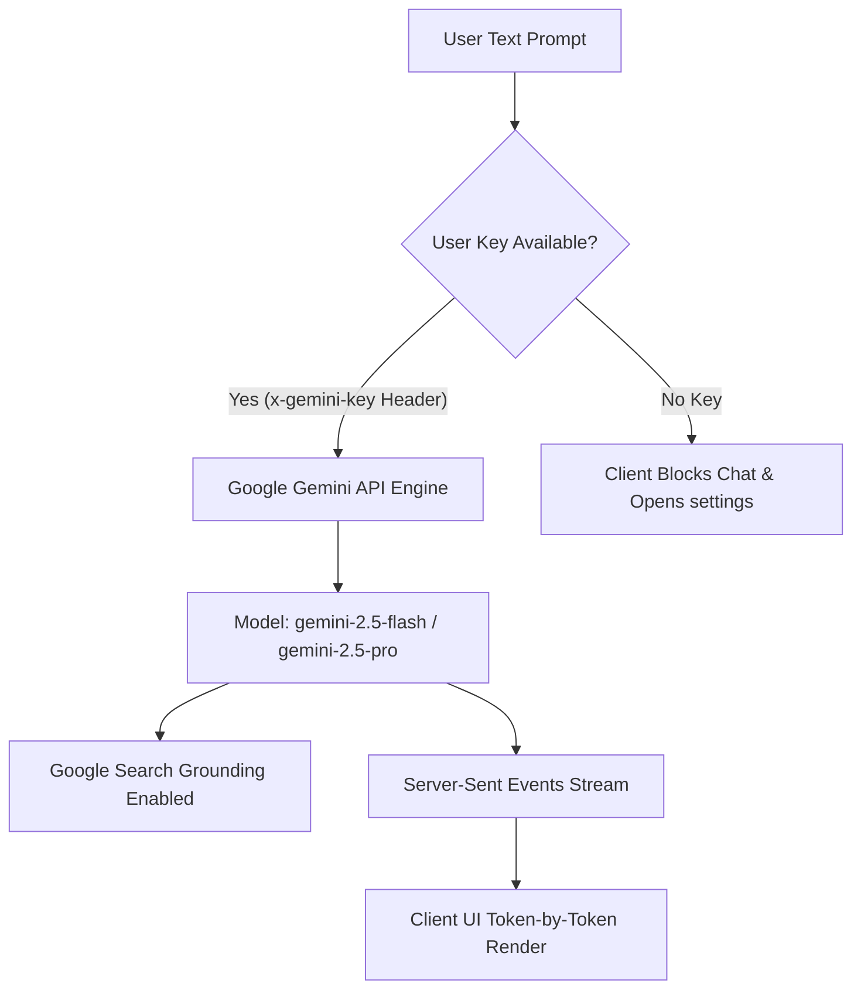

# AI Assistant & Integration System

**Vertex Connect** features a fully integrated personal AI Assistant. It operates strictly as a real-time, text-based conversation drawer utilizing the cloud-hosted Google Gemini API with Google Search grounding. 

While the backend server includes logic for local model routing (via Ollama) and an in-memory document parsing route, these capabilities are currently unexposed in the client user interface.

---

## 1. Cloud-Engine Routing & Authentication (BYOK)

The client enforces a **Bring-Your-Own-Key (BYOK)** security design. To interact with the AI assistant, the user must input their own private API key in the Settings panel. 

The application coordinates authentication and generation as follows:



### Key Management
* **Storage**: Custom keys are stored in MongoDB under `customAiApiKey` (saved via `PUT /api/user/ai-key`) and cached in the browser's `localStorage` (`vertex_custom_gemini_key`).
* **Request Header**: The key is attached to every assistant prompt request under the custom header `x-gemini-key` and processed by the backend.

### Google Search Grounding
When running on the Gemini model, the assistant is configured with Google Search tools enabled:
```javascript
const model = genAI.getGenerativeModel({
  model: "gemini-2.5-flash",
  tools: [{ googleSearch: {} }] // Enables real-time Google Search grounding
});
```
This enables the assistant to answer queries on recent events by retrieving search queries, injecting them into the prompt, and referencing search citations in standard markdown.

---

## 2. Server-Sent Events (SSE) Streaming

To provide a responsive, real-time typing effect:
* The backend delivers responses using Server-Sent Events with the header `Content-Type: text/event-stream`.
* Text tokens are pushed to the client immediately as they are generated by the model.
* The frontend reads the chunk stream via a readable stream reader (`response.body.getReader()`) and updates the UI buffer dynamically.

---

## 3. Backend-Only Features (Inactive in Client UI)

The backend code contains the following utility features that are not exposed to the user-facing client interface:

### 1. In-Memory Document Parser (`POST /api/ai/parse-file`)
* A Multer in-memory storage upload route configured to parse documents up to 10MB.
* It uses `pdf-parse` for PDF extractions and `mammoth` for DOCX content, truncating extracted text to 15,000 characters.
* Since the frontend client input form does not contain any file input buttons or dropzones, this endpoint is currently unused in the production flow.

### 2. Local Ollama Engine Fallback
* A local execution model targeting `http://localhost:11434` (Ollama models like `gemma:latest` or `llama3:latest`).
* Because the React client strictly blocks prompt submissions when `customGeminiKey` is missing, LLM requests are routed exclusively to the Gemini API using the client's provided key.

---

## 4. Prompt Response Hashing & Caching

To reduce Google Gemini API quota consumption and server CPU loads:
1. The server serializes the conversation message history payload, model parameters, and target temperature.
2. It generates a SHA-256 hash representing the conversation state:
   ```javascript
   const cacheHash = crypto.createHash("sha256").update(payloadString).digest("hex");
   ```
3. If a cached response exists under `ai:response:<hash>` in Redis, the server skips LLM execution entirely. It streams the cached response from memory back to the client at a simulated speed of 15ms per token.
4. If a cache miss occurs, the LLM is queried and the final response is saved to Redis for 1 hour.
