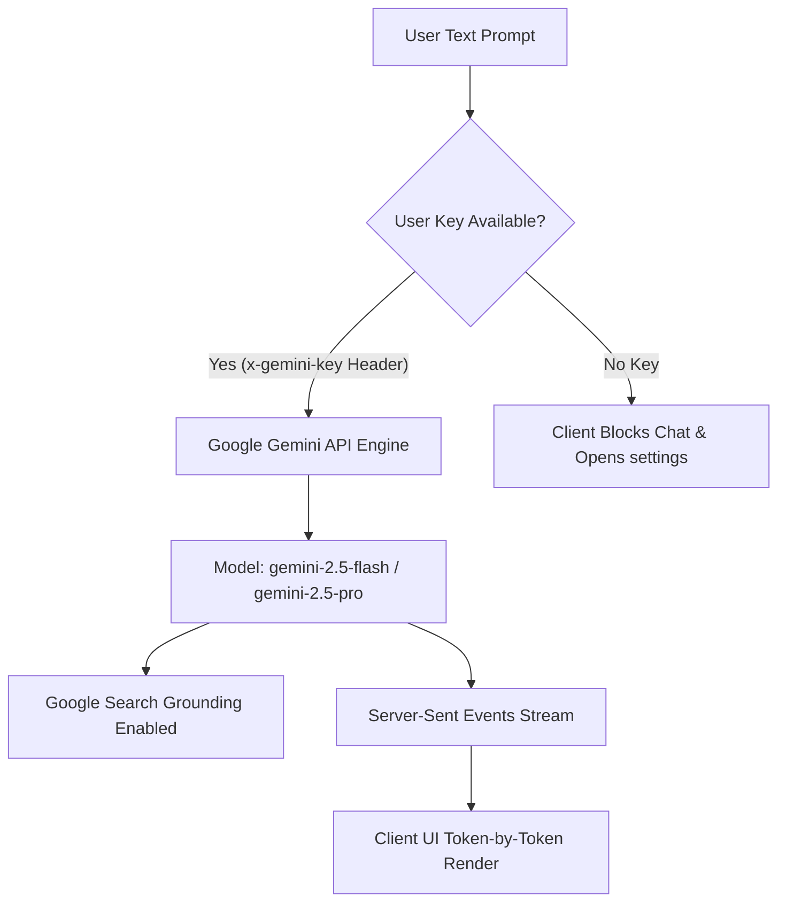

# AI Assistant & Integration System

**Vertex Connect** features a fully integrated personal AI Assistant. It operates strictly as a real-time, text-based conversation drawer utilizing the cloud-hosted Google Gemini API with Google Search grounding. 

While the backend server includes logic for local model routing (via Ollama) and an in-memory document parsing route, these capabilities are currently unexposed in the client user interface.

---

## 1. AI Assistant Routing & Security (BYOK)

The app uses a "Bring Your Own Key" (BYOK) design. To use the AI assistant, you must enter your own Gemini API key in the Settings panel.

The app processes AI requests as follows:



### Key Management
* **Storage**: Your API key is saved securely in MongoDB under `customAiApiKey` and cached in your browser's local storage (`vertex_custom_gemini_key`) so you don't have to enter it again.
* **Request Header**: The key is sent to the backend with every prompt in the `x-gemini-key` header.

### Real-time Search
The assistant is set up to use Google Search to answer questions about recent events:
```javascript
const model = genAI.getGenerativeModel({
  model: "gemini-2.5-flash",
  tools: [{ googleSearch: {} }] // Enables real-time Google Search grounding
});
```
This lets the assistant search the web for recent events, inject findings into the prompt, and show source links in its replies.

---

## 2. Server-Sent Events (SSE) Streaming

To show replies instantly as they are generated:
* The backend streams responses back using Server-Sent Events with the header `Content-Type: text/event-stream`.
* Words are sent to the app immediately as the AI types them.
* The frontend reads this stream and updates the chat bubble smoothly.

---

## 3. Backend-Only Features (Inactive in Client UI)

The backend includes helper tools that are not visible or active in the web interface:

### 1. Document Reader (`POST /api/ai/parse-file`)
* Reads PDF and DOCX files up to 10MB to extract text.
* Limits the text to 15,000 characters so it fits in the AI's memory.
* This endpoint is currently inactive because the frontend does not have file upload buttons for the AI.

### 2. Local AI Fallback
* The backend has code to connect to a local AI server (Ollama at `http://localhost:11434`).
* This is currently unused because the app is set up to only route queries to the Gemini API using the user's key.

---

## 4. Prompt Response Hashing & Caching

To save your Gemini API limits and make responses faster:
1. The server serializes the conversation history, model settings, and temperatures.
2. It creates a secure hash of the prompt:
   ```javascript
   const cacheHash = crypto.createHash("sha256").update(payloadString).digest("hex");
   ```
3. If a saved reply exists under `ai:response:<hash>` in Redis, the server sends the saved answer back immediately at a simulated typing speed of 15ms per character, without querying Gemini.
4. If the prompt is new, the server asks Gemini and saves the reply in Redis for 1 hour.
