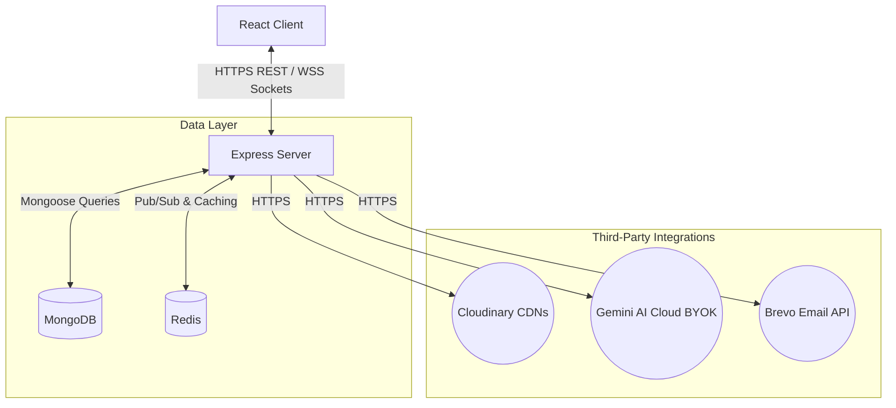
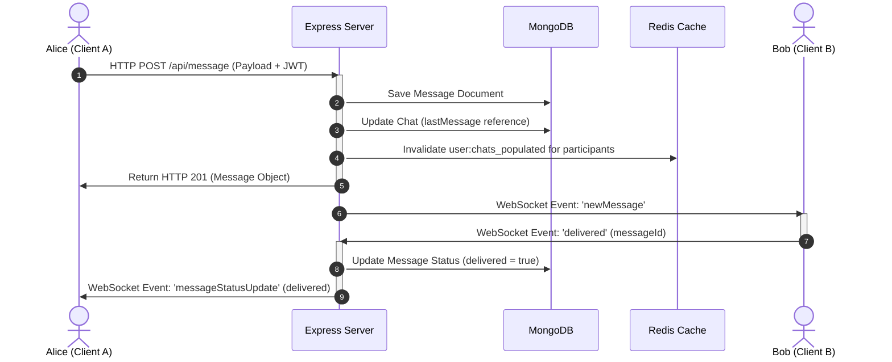

# High-Level Architecture

**Vertex Connect** is designed around a hybrid real-time architecture that combines a structured **REST API** with an event-driven **Socket.io** gateway, using **Redis** for database caching, WebSocket horizontal scaling, and active call coordination.

---

## High-Level System Architecture

The following diagram illustrates the interaction between the React frontend client, the Express server instance, the MongoDB database, and the Redis cache/broker layer:

> [!NOTE]
> **Scalability Design**: Although currently deployed as a single Express server instance on Render, the system implements a Redis Pub/Sub adapter (`@socket.io/redis-adapter`) to allow horizontal scaling (multiple load-balanced server instances) at any time.

---

## Architectural Decisions

### 1. Database Caching Layer (Redis)
To minimize disk reads and optimize latency, the backend leverages Redis for active caches:
* **User Profiles**: Cached for 30 minutes to shield MongoDB from authentication lookups.
* **Privacy Controls & Follow States**: Cached for 1 hour to verify message and calling permissions on the fly.
* **Hashed AI Responses**: Hashed prompts are cached in Redis to instantly serve common questions without invoking model compute.

### 2. Horizontal WebSocket Scaling (Redis Adapter)
Socket.io maintains connections in-memory on each server node. To support horizontal scaling (running multiple server instances behind a load balancer), the servers integrate `@socket.io/redis-adapter`.
* All socket events are published to Redis Pub/Sub channels.
* Redis automatically broadcasts events across instances, ensuring that active users can seamlessly exchange messages and call signaling regardless of which server instance they are connected to.

### 3. Active Call Coordination (Mutex-like Lock)
To prevent users from receiving multiple calls or dial requests simultaneously:
* Dials and connections check for existing active keys in Redis (`active_call:<userId>`).
* Initiating a call sets a temporary mutex lock (60-second expire), which is updated to a 2-hour session key once the call is answered.
* The lock is deleted instantly when the call ends or disconnects.

---

## Real-Time Messaging & Status Data Flow

The sequence diagram below details the path a message takes from transmission to receipt, along with real-time state broadcasts:

1. **REST Message Delivery**: Messages are sent via REST endpoints to guarantee ACID transactions, file reference logging, and input validations.
2. **Cache Invalidation**: The server invalidates the populated chat list caches in Redis for both Alice and Bob.
3. **Real-time Push**: The message is instantly pushed to Bob over WebSockets. If Bob is active, a `delivered` status notification is returned to update Alice's message receipt state.
