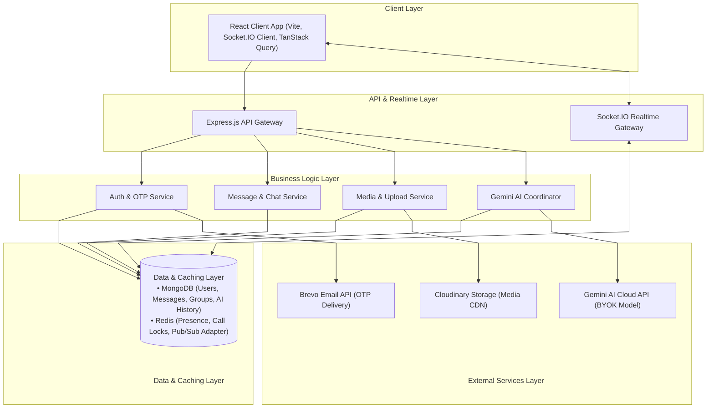
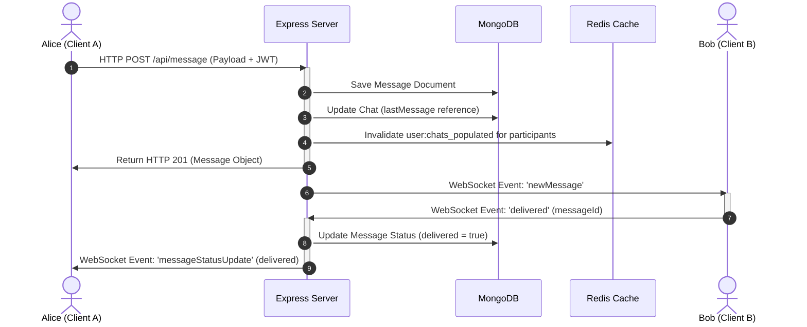

# High-Level Architecture

**Vertex Connect** is designed around a hybrid real-time architecture that combines a structured **REST API** with an event-driven **Socket.io** gateway, using **Redis** for database caching, WebSocket horizontal scaling, and active call coordination.

---

## High-Level System Architecture

This diagram shows how the React frontend, Express backend, MongoDB database, and Redis cache work together:

> [!NOTE]
> **Running on Multiple Servers**: Although currently running as a single Express server on Render, the system uses a Redis Pub/Sub adapter (`@socket.io/redis-adapter`) so that you can run multiple backend servers behind a load balancer at any time.

---

## Architectural Decisions

### 1. Database Caching Layer (Redis)
To make the backend faster and reduce database load, it stores frequently used data in Redis:
* **User Profiles**: Cached for 30 minutes so the server doesn't have to check MongoDB for every request.
* **Privacy & Follow Settings**: Cached for 1 hour to quickly check if a user is allowed to send messages or make calls.
* **AI Responses**: Saved in Redis so if another user asks the same question, the app can show the saved answer immediately without asking the AI again.

### 2. Multi-Server WebSockets (Redis Adapter)
WebSockets are normally saved in a server's temporary memory. To support running multiple servers at the same time, we use `@socket.io/redis-adapter`.
* All chat events are sent through Redis.
* Redis shares them with all server instances, so users can chat with each other even if they are connected to different servers.

### 3. Active Call Coordination (Preventing Double Calls)
To stop users from making or receiving more than one call at a time:
* The server checks Redis for an active call key (`active_call:<userId>`) before starting a call.
* Starting a call locks the user's status for 60 seconds (to handle ringing). If the call is answered, this lock is extended for up to 2 hours.
* The lock is deleted immediately when the call ends.

---

## Real-Time Messaging & Status Data Flow

The diagram below shows the path a message takes from being sent to being received:

1. **REST Message Delivery**: Messages are sent using standard HTTP requests to ensure they are saved correctly in the database and checked for safety.
2. **Cache Clear**: The server deletes the old chat list from Redis for both users so they see the new message immediately.
3. **Real-time Push**: The message is sent to Bob immediately over WebSockets. If Bob is online, Alice gets a "delivered" status checkmark.
