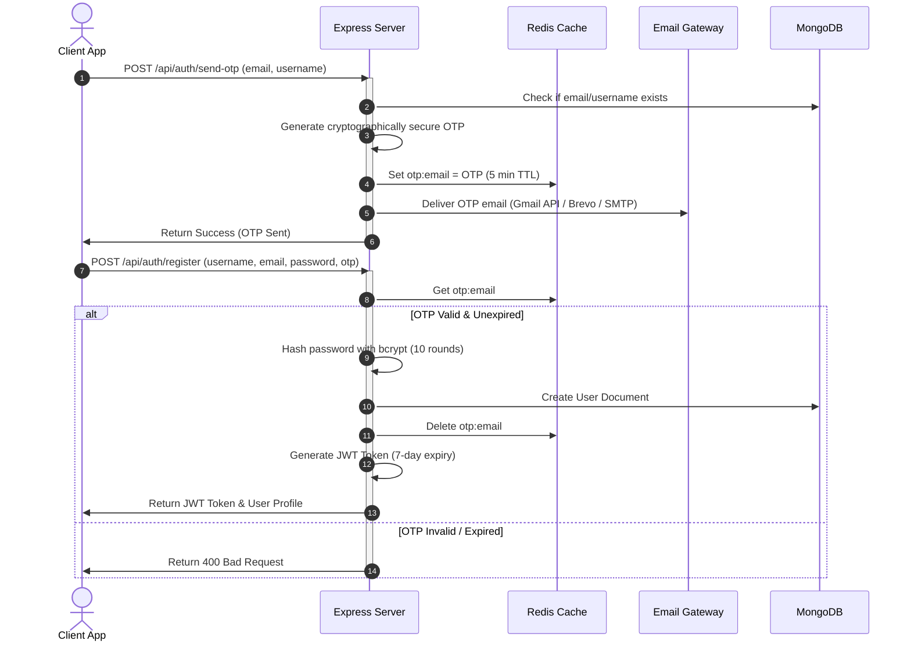

# Authentication & Security Flows

**Vertex Connect** implements a multi-tier authentication and access control system to secure user accounts and protect private conversation history.

---

## 1. Registration Flow

To prevent spam accounts and verify email ownership, registration requires One-Time Password (OTP) verification before account creation:



---

## 2. Login Flow

* **Endpoints**: `POST /api/auth/login` accepts either `email` or `username` as an identifier.
* **Verification**: Compares the incoming plain-text password against the stored bcrypt hash using `bcrypt.compare()`.
* **JWT Generation**: Generates a stateless JSON Web Token signed with a HS256 secret key, containing the user's ID. It is configured to expire in 7 days:
  ```javascript
  jwt.sign({ id: user._id }, process.env.JWT_SECRET, { expiresIn: "7d" });
  ```
* **Client Storage**: The token and core profile elements are stored inside the client's browser `localStorage` under the key `userInfo`.

---

## 3. Password Recovery Flow

* **Forgot Password**: `POST /api/auth/forgot-password` generates a password reset OTP and delivers it to the user's email, caching it in Redis with a 5-minute expiry.
* **Password Reset**: `POST /api/auth/reset-password` accepts the email, OTP, new password, and confirm password. If the OTP matches, the password is encrypted and updated. The user profile cache in Redis (`user:profile:<userId>`) is immediately deleted to force profile synchronization.

---

## 4. Chat Locking & Decryption (Access Security)

For enhanced privacy, users can lock individual direct messages or group chats with a dedicated passcode:

### Locking a Chat
* **Endpoint**: `POST /api/chat/lock/:chatId`
* **Mechanism**: Receives a plain passcode, hashes it on the backend, and stores it in the `Chat` document within the `lockedBy` array alongside the user's ID:
  ```javascript
  chat.lockedBy.push({ user: userId, passcodeHash: hashedPasscode });
  ```

### Accessing a Locked Chat
* **Client-side Session Storage**: When a user unlocks a chat in the UI, the correct passcode is cached in `sessionStorage` for the duration of the browser tab session under `lock_passcode_<chatId>`.
* **Request Header Interception**: The client's Axios API client intercepts all message requests and appends the passcode:
  `x-lock-passcode: <passcode>`
* **Server Verification**: The server intercepts queries to fetch message histories. It hashes the header's value and compares it with the chat's `lockedBy` hash. Access is denied with a `403 Forbidden` status if the passcode is incorrect or missing.
