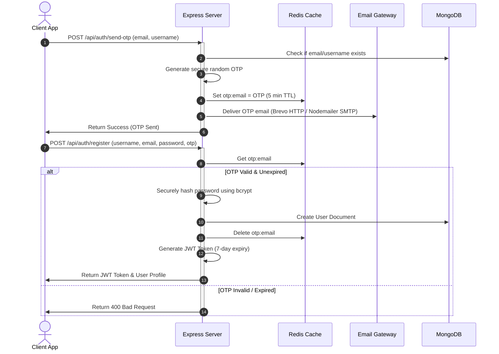

# Authentication & Security Flows

**Vertex Connect** implements a multi-tier authentication and access control system to secure user accounts and protect private conversation history.

---

## 1. Registration Flow

To prevent fake accounts and confirm email ownership, you must verify your email with a One-Time Password (OTP) before creating an account:



---

## 2. Login Flow

* **Login**: `POST /api/auth/login` lets users log in using either their `email` or `username`.
* **Verification**: Compares the entered password with the saved database hash using `bcrypt.compare()` to make sure they match.
* **JWT Generation**: Creates a secure login token (JWT) containing the user's ID. The token expires in 7 days:
  ```javascript
  jwt.sign({ id: user._id }, process.env.JWT_SECRET, { expiresIn: "7d" });
  ```
* **Client Storage**: The browser saves this token and the user profile in `localStorage` under the key `userInfo`.

---

## 3. Password Recovery Flow

* **Forgot Password**: `POST /api/auth/forgot-password` generates a reset OTP, sends it to the user's email, and saves it in Redis for 5 minutes.
* **Password Reset**: `POST /api/auth/reset-password` takes the email, OTP, and new password. If the OTP is correct, it updates the password. It also clears the user's profile from the Redis cache (`user:profile:<userId>`) so the latest details are loaded next time.

---

## 4. Chat Locking & Decryption (Access Security)

For extra privacy, users can lock individual chats with a passcode:

### Locking a Chat
* **Endpoint**: `POST /api/chat/lock/:chatId`
* **How it works**: The server takes a passcode, hashes it for safety, and saves it in the `Chat` document next to the user's ID:
  ```javascript
  chat.lockedBy.push({ user: userId, passcodeHash: hashedPasscode });
  ```

### Accessing a Locked Chat
* **Browser Storage**: When you unlock a chat, the passcode is saved in the browser's temporary memory (`sessionStorage`) so you don't have to re-enter it. It is deleted as soon as you close the tab.
* **Request Header**: The frontend automatically adds this passcode to request headers:
  `x-lock-passcode: <passcode>`
* **Server Check**: Before returning messages, the server hashes the passcode and compares it with the one in the database. If it is wrong or missing, access is denied (returns a 403 status).
