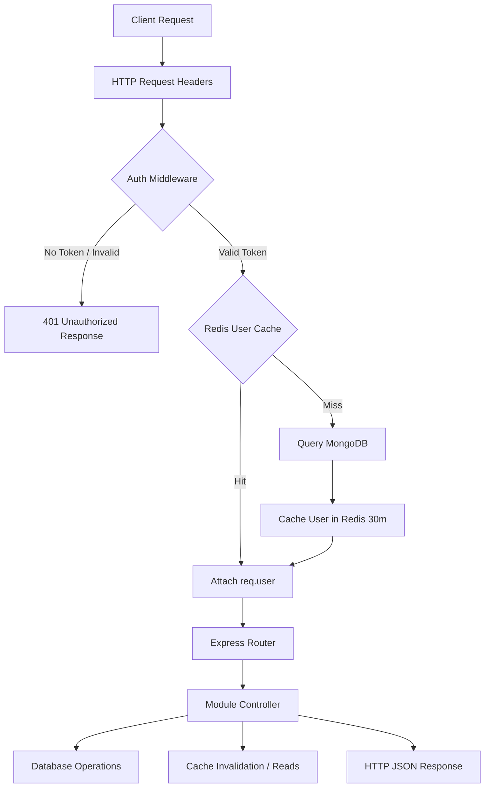

# Backend Server Architecture

The backend of **Vertex Connect** is a structured, scalable application powered by **Express** (v5) running on **Node.js**. It exposes a secure REST API and manages real-time WebSocket communication.

---

## Technical Stack

* **Express.js (v5.2.1)**: Web framework to handle HTTP requests.
* **Socket.io**: Library for real-time messages and updates.
* **Mongoose (MongoDB ORM)**: Manages MongoDB schemas, data validation, and queries.
* **Redis**: Temporary fast storage (caching) and multi-server coordinator.
* **JSON Web Tokens (JWT)**: Login tokens for stateless user sessions.
* **Cloudinary**: Cloud storage for images and media files.
* **Multer**: Handles file uploads.

---

## Directory Layout

```bash
server/
├── src/
│   ├── config/             # Database and cloud client configurations (DB, Redis, Cloudinary)
│   ├── middleware/         # Custom Express middlewares (Auth, Multer, rate limits)
│   ├── models/             # Mongoose schemas (User, Message, Chat, Block, etc.)
│   ├── modules/            # Feature modules (controllers, routes)
│   │   ├── ai/             # AI assistant endpoints and document parsing
│   │   ├── auth/           # Login, registration, and OTP deliveries
│   │   ├── call/           # Voice/video history logs and pings
│   │   ├── chat/           # Chat management, group permissions, and locking
│   │   ├── media/          # Cloudinary uploads and deduplication check
│   │   ├── message/        # Message operations, polls, reactions, and search
│   │   └── user/           # Profiles, follow status, and preferences
│   ├── sockets/            # Socket.io connection handlers and signaling
│   └── utils/              # Utility helpers (email, caching, privacy settings)
├── server.js               # Application entry point, server listener, keep-alive timers
└── package.json            # Node.js configurations and dependency scripts
```

---

## Core Middlewares

### 1. User Login Verification (`src/middleware/authMiddleware.js`)
Protects routes by checking user login tokens in the request headers:
* Extracts the security token: `Authorization: Bearer <JWT>`
* Reads the user ID from the token.
* Checks the Redis cache for the user's profile (`user:profile:<userId>`) before checking MongoDB.
* If it is not in the cache, it loads the profile from MongoDB (without the password) and saves it in Redis for 30 minutes to make future checks faster.
* Saves the user information in `req.user` for the rest of the request.

### 2. File Upload Middleware (`src/middleware/uploadMiddleware.js`)
Sets up **Multer** to capture files in memory. It enforces safety rules:
* Restricts file size and types (mimetypes).
* Sends files directly to Cloudinary without writing them to the server's hard drive.

---

## Request Lifecycle

The lifecycle of an API request to a protected endpoint follows a structured pipeline:



1. **Routing**: The request goes to `server.js` and then `src/app.js` to find the correct route handler (like `/api/message/*`).
2. **Authentication**: The Auth Middleware verifies the JWT login token and loads the user profile from cache or database.
3. **Controller**: The controller runs the actual code, processes inputs, and reads/writes the database.
4. **Clear Cache**: The controller clears any outdated Redis cache (like deleting the old chat list from cache when a new message is sent) to ensure the client sees updated data.
5. **Reply**: The server sends back the JSON response along with standard HTTP status codes.
