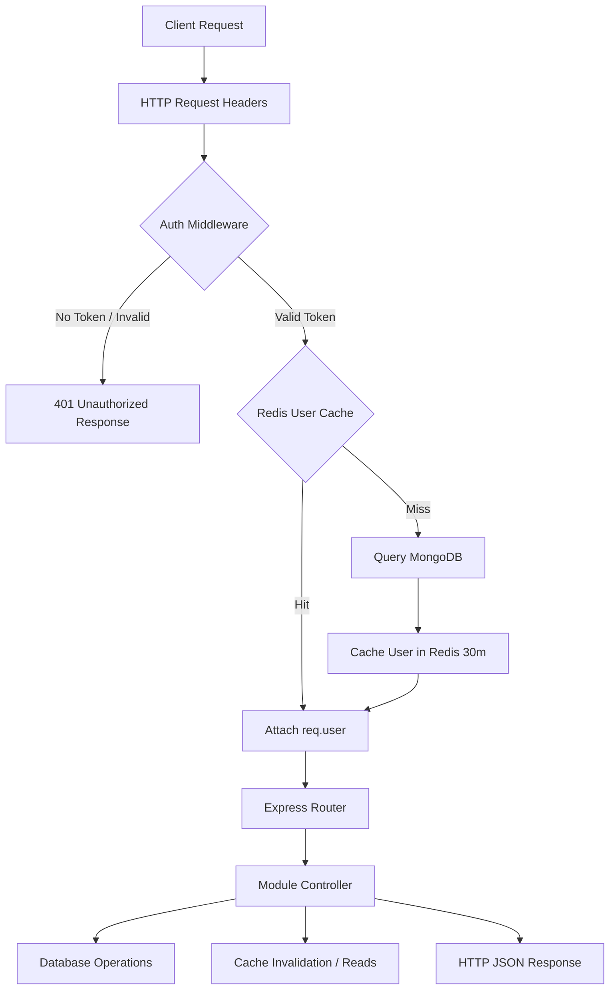

# Backend Server Architecture

The backend of **Vertex Connect** is a structured, scalable application powered by **Express** (v5) running on **Node.js**. It exposes a secure REST API and manages real-time WebSocket communication.

---

## Technical Stack

* **Express.js (v5.2.1)**: HTTP web framework.
* **Socket.io**: Real-time event-driven communication framework.
* **Mongoose (MongoDB ORM)**: Data schemas, validation, and object mappings.
* **Redis**: Caching system and WebSocket horizontal adapter.
* **JSON Web Tokens (JWT)**: Stateless session management and authorization.
* **Cloudinary**: High-performance storage and CDN for uploaded media.
* **Multer**: File upload stream handling.

---

## Directory Layout

```bash
server/
├── src/
│   ├── config/             # Database and cloud client configurations (DB, Redis, Cloudinary)
│   ├── middleware/         # Custom Express middlewares (Auth, Multer, rate limits)
│   ├── models/             # Mongoose schemas (User, Message, Chat, Block, etc.)
│   ├── modules/            # Feature modules (controllers, routes)
│   │   ├── ai/             # AI assistant endpoints and document parsing
│   │   ├── auth/           # Login, registration, and OTP deliveries
│   │   ├── call/           # Voice/video history logs and pings
│   │   ├── chat/           # Chat management, group permissions, and locking
│   │   ├── media/          # Cloudinary uploads and deduplication check
│   │   ├── message/        # Message operations, polls, reactions, and search
│   │   └── user/           # Profiles, follow status, and preferences
│   ├── sockets/            # Socket.io connection handlers and signaling
│   └── utils/              # Utility helpers (email, caching, privacy settings)
├── server.js               # Application entry point, server listener, keep-alive timers
└── package.json            # Node.js configurations and dependency scripts
```

---

## Core Middlewares

### 1. Authorization Middleware (`src/middleware/authMiddleware.js`)
Protects secure endpoints by inspecting incoming authorization headers:
* Extracts the token: `Authorization: Bearer <JWT>`
* Decodes user ID using the secret key.
* **Performance optimization**: Checks Redis cache for the user's profile (`user:profile:<userId>`) before querying MongoDB.
* If a cache miss occurs, retrieves user data from MongoDB (excluding password) and caches it for 30 minutes.
* Attaches the user object to the request: `req.user = user`.

### 2. File Upload Middleware (`src/middleware/uploadMiddleware.js`)
Configures **Multer** in-memory storage to capture file buffers. File validation enforces strict constraints:
* Restricts files by file size and mimetype.
* Prepares buffers for streaming uploads directly to Cloudinary, avoiding local disk writes.

---

## Request Lifecycle

The lifecycle of an API request to a protected endpoint follows a structured pipeline:



1. **Routing**: The request hits `server.js` and is passed to `src/app.js` which matches the module path prefix (e.g., `/api/message/*`).
2. **Authentication**: The Auth Middleware verifies the JWT signature and sets the cached user profile.
3. **Controller Execution**: The controller handles request parsing, executes business logic, and manages database queries.
4. **Cache Invalidation**: Controllers invalidate relevant caches (e.g. invalidating chat lists in Redis after a new message is sent) to ensure client consistency.
5. **Response Delivery**: JSON data is formatted and returned to the client along with standard HTTP status codes.
