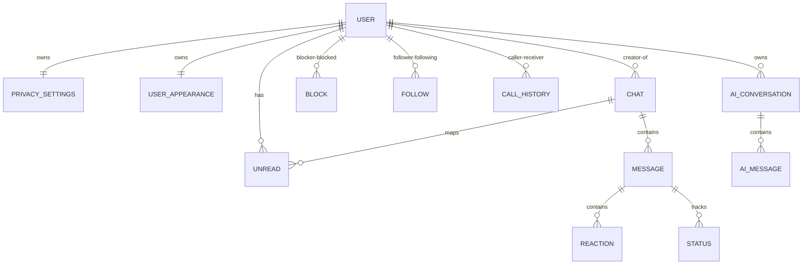

# Database Design & Schemas

**Vertex Connect** uses **MongoDB** as its primary document store, integrated via the **Mongoose** ODM. All models, field validations, indexes, and relations are mapped below.

---

## Entity-Relationship Overview

The database connects profiles, real-time message streams, chat statuses, and social relations:

---

## Mongoose Schemas & Fields

### 1. User Schema (`User.js`)
Stores account profiles, authentication hashes, and user settings:
* `username`: String (required, unique, indexed, trimmed)
* `email`: String (required, unique, indexed, trimmed)
* `password`: String (required, bcrypt hashed)
* `avatar`: String (URL link, default: `""`)
* `status`: String (default: `"offline"`)
* `about`: String (default: `"Hey there! I am using Vertex Connect."`)
* `lastSeen`: Date (default: `Date.now`)
* `blockedUsers`: Array of ObjectIds referencing `User`
* `customAiApiKey`: String (secure user-provided Gemini key, default: `""`)

### 2. Chat Schema (`Chat.js`)
Manages channel settings, group membership details, and access tokens:
* `chatName`: String (trimmed group chat title)
* `isGroupChat`: Boolean (default: `false`)
* `participants`: Array of ObjectIds referencing `User`
* `groupAdmin`: ObjectId referencing `User`
* `groupAvatar` & `groupDescription`: String (default: `""`)
* `inviteCode`: String (unique join code, default: `""`)
* `creator`: ObjectId referencing `User`
* `lastMessage`: ObjectId referencing `Message`
* `roles`: Array of role sub-documents:
  * `user`: ObjectId referencing `User`
  * `role`: String (enum: `owner`, `admin`, `member`, `left`, default: `member`)
  * `joinedAt`: Date (default: `Date.now`)
  * `leftAt`: Date
* `rules`: Rules sub-document (`editGroupInfo`, `editProfilePhoto`, `addMembers` - all enum `everyone`, `admins`, `owner`, default: `everyone`)
* `pinnedMessages`: Array of ObjectIds referencing `Message`
* `deletedBy`: Array of sub-documents containing `user` (ObjectId) and `deletedAt` (Date)
* `clearedBy`: Array of sub-documents containing `user` (ObjectId) and `clearedAt` (Date)
* `archivedBy`: Array of sub-documents containing `user` (ObjectId) and `archivedAt` (Date)
* `pinnedBy`: Array of sub-documents containing `user` (ObjectId) and `pinnedAt` (Date)
* `lockedBy`: Array of lock sub-documents:
  * `user`: ObjectId referencing `User`
  * `passcodeHash`: String (required, bcrypt hashed passcode)
  * `lockedAt`: Date (default: `Date.now`)
* `markedUnreadBy`: Array of sub-documents containing `user` (ObjectId) and `markedAt` (Date)

### 3. Message Schema (`Message.js`)
Handles chat events, content, legacy file fallbacks, reactions, and threaded replies:
* `chat`: ObjectId referencing `Chat` (required, indexed)
* `sender`: ObjectId referencing `User` (required)
* `messageType`: String (enum: `text`, `media`, `image`, `video`, `audio`, `file`, `poll`, default: `text`)
* `content`: String (trimmed text content, default: `""`)
* `caption`: String (trimmed media description, default: `""`)
* `media`: Array of media sub-documents:
  * `url`: String (required)
  * `type`: String (enum: `image`, `video`, `audio`, `file`, required)
  * `thumbnailUrl`: String (default: `""`)
  * `fileName`: String (default: `""`)
  * `fileSize`: Number (default: `0`)
  * `mimeType`: String (default: `""`)
  * `duration`: Number (default: `0`)
  * `peaks`: Array of Numbers (waveform audio peaks, default: `[]`)
* `mediaUrl`, `thumbnailUrl`, `fileName`, `fileSize`, `mimeType`, `duration`: Legacy string/number fields (for backward compatibility support)
* `reactions`: Array of sub-documents containing `user` (ObjectId) and `emoji` (String)
* `messageStatus`: Array of status sub-documents tracking delivery states:
  * `user`: ObjectId referencing `User`
  * `delivered`: Boolean (default: `false`)
  * `deliveredAt`: Date
  * `read`: Boolean (default: `false`)
  * `readAt`: Date
* `isDeleted`: Boolean (default: `false`)
* `deletedFor`: Array of ObjectIds referencing `User` (default: `[]`)
* `edited`: Boolean (default: `false`)
* `isSystem`: Boolean (default: `false`)
* `editedAt`: Date
* `replyTo`: Thread reply sub-document containing `messageId` (ObjectId), `senderId` (ObjectId), `senderName` (String), `text` (String), `messageType` (String), and `mediaThumbnail` (String)
* `poll`: Poll options sub-document:
  * `question`: String (trimmed)
  * `options`: Array of option sub-documents:
    * `optionText`: String (trimmed)
    * `votes`: Array of ObjectIds referencing `User` (default: `[]`)
  * `allowMultiple`: Boolean (default: `false`)
  * `showVoters`: Boolean (default: `true`)

### 4. Privacy Settings Schema (`PrivacySettings.js`)
Configures account boundary settings for social access:
* `user`: ObjectId referencing `User` (required, unique)
* `accountType`: String (enum: `public`, `private`, default: `public`)
* `messagesPermission`: String (enum: `everyone`, `followers`, `mutual`, `nobody`, default: `everyone`)
* `groupsPermission`: String (enum: `everyone`, `followers`, `mutual`, default: `everyone`)
* `showLastSeen`: Boolean (default: `true`)
* `showOnline`: Boolean (default: `true`)
* `profilePhotoPermission`: String (enum: `everyone`, `followers`, `mutual`, `nobody`, default: `everyone`)
* `emailVisibility`: String (enum: `everyone`, `followers`, `mutual`, `nobody`, default: `everyone`)

### 5. User Appearance Schema (`UserAppearance.js`)
Saves chat customizations, fonts, and client behavior configurations:
* `user`: ObjectId referencing `User` (required, unique)
* `themeMode`: String (enum: `light`, `dark`, default: `dark`)
* `wallpaperType`: String (enum: `default`, `color`, `gradient`, `custom`, default: `default`)
* `wallpaperValue`: String (Hex code, gradient string, or CDN URL, default: `""`)
* `wallpaperOpacity`: Number (0 to 100, default: `100`)
* `fontSize`: String (enum: `small`, `medium`, `large`, default: `medium`)
* `fontStyle`: String (default: `"system"`)
* `compactMode`: Boolean (default: `false`)
* `enterToSend`: Boolean (default: `true`)
* `soundsEnabled`: Boolean (default: `true`)
* `autoScroll`: Boolean (default: `true`)

### 6. Unread Schema (`Unread.js`)
Maintains read-receipts and counters for private/group channels:
* `userId`: ObjectId referencing `User` (required)
* `chatId`: ObjectId referencing `Chat` (required)
* `chatType`: String (enum: `private`, `group`, required)
* `unreadCount`: Number (default: `0`, min: `0`)
* `lastReadMessageId`: ObjectId referencing `Message`
* `lastReadAt`: Date (default: `Date.now`)
* **Index**: Unique compound index on `userId` + `chatId`.

### 7. Uploaded File Schema (`UploadedFile.js`)
Indices file metadata and content hashes for deduplication:
* `hash`: String (required, unique, indexed SHA-256 string)
* `url`: String (required CDN link)
* `type`: String (required)
* `fileName`: String (required)
* `fileSize`: Number (required)
* `mimeType`: String (required)
* `duration`: Number (default: `0`)
* `thumbnailUrl`: String (default: `""`)

### 8. Block Schema (`Block.js`)
* `blocker`: ObjectId referencing `User` (required)
* `blocked`: ObjectId referencing `User` (required)

### 9. Follow Schema (`Follow.js`)
* `follower`: ObjectId referencing `User` (required)
* `following`: ObjectId referencing `User` (required)

### 10. Call History Schema (`CallHistory.js`)
* `caller`: ObjectId referencing `User` (required)
* `receiver`: ObjectId referencing `User` (required)
* `type`: String (enum: `audio`, `video`, required)
* `status`: String (enum: `missed`, `completed`, `declined`, `failed`, required)
* `duration`: Number (in seconds, default: `0`)
* `startedAt`: Date (default: `Date.now`)

### 11. AI schemas (`AiConversation.js` & `AiMessage.js`)
* **`AiConversation`**: Tracks AI sessions. Stores `user` (ObjectId), `title` (String), `model` (String), `temperature` (Number), `maxTokens` (Number), and `isSaved` (Boolean).
* **`AiMessage`**: Tracks chat tokens. Stores `conversation` (ObjectId), `role` (enum: `user`, `assistant`), `content` (String), and `attachments` (Array of sub-documents storing `fileName`, `fileSize`, `mimeType`, and `extractedText`).

---

## Core Database Optimization Decisions

### 1. Database Indexing
Mongoose indices are set up on high-frequency search properties:
* **Authentication Lookups**: Unique indexes on `User.username` and `User.email`.
* **Social Unique Limits**: Unique compound indexes on `Follow` (composite key on `follower` + `following`) and `Block` (`blocker` + `blocked`).
* **Chat Message Speeds**: `Message.chat` is indexed to optimize conversation history fetches.
* **Unread Tracker**: Unique compound index on `Unread.userId` + `Unread.chatId`.

### 2. Cache Invalidation Patterns
To maintain consistency between Redis caches and Mongoose documents, cache invalidations are explicitly run by controllers after any updates:
* Creating a message deletes the chat list cache `chat:list:<userId>`.
* Inviting a user or updating group properties deletes the chat metadata cache `chat:meta:<chatId>`.
* Modifying user follow states clears the follower count cache `follow:status:<userId>`.
