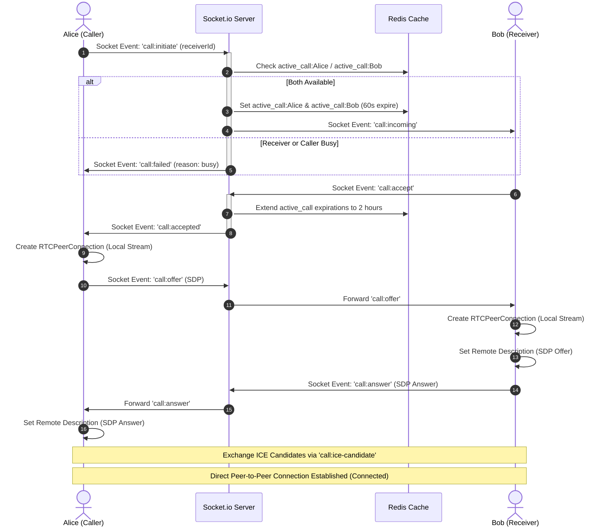

# Peer-to-Peer WebRTC Calling

**Vertex Connect** supports high-fidelity, real-time voice and video calling. This feature is implemented client-side using browser **WebRTC APIs** and coordinated backend-side via **Socket.io** signaling and **Redis** status locks.

---

## WebRTC Signaling & Connection Flow

WebRTC requires a signaling server to exchange session metadata (SDP offers/answers and ICE candidates) before establishing a direct connection:

---

## Call Security & Availability Management

### 1. Privacy Check
Before routing any call signals, the server executes a privacy verification check (`checkCallPermission`).
* Calling rights are bound to message permissions.
* If Bob's account is private, Alice must be a mutual follower.
* If Bob has set his messaging permission to `followers`, Alice must follow Bob.
* If a block relationship exists in the `Block` schema (either blocker or blocked), the call is immediately blocked.

### 2. Mutex Call Locking in Redis
To prevent overlapping calls or multiple dial requests:
* When Alice initiates a call, the server checks Redis keys `active_call:Alice` and `active_call:Bob`.
* If either exists, the call is blocked, returning a `receiver_busy` or `you_busy` state.
* If both are free, the server writes active keys:
  * `active_call:Alice` & `active_call:Bob` (with a 60-second TTL to handle unanswered ringing).
  * `call_peer:<callId>:Alice` -> `Bob` (and vice versa).
* When Bob answers, the server extends the `active_call` and `call_peer` keys' TTL to 2 hours.
* When either Alice or Bob ends the call, these keys are instantly deleted.

---

## Client-Side Web Audio API Synthesis (`toneSynthesizer.js`)

Instead of downloading static audio files for ringtones and call alerts, the client utilizes the browser's native **Web Audio API** (`AudioContext`) to synthesize wave shapes in real time. This keeps application bundles lightweight and ensures non-jarring audio cues:

### 1. Outgoing Sonar Dial Tone (`playDialTone`)
* **Frequency**: Alternates dual frequencies (440 Hz + 480 Hz) to create a standard telephone line ringing effect.
* **Timing**: Alternates 1.5 seconds of sound (utilizing a soft rise/fall gain ramp: `linearRampToValueAtTime`) followed by 2 seconds of silence.

### 2. Incoming Ringtone (`playIncomingRingtone`)
* **Melody**: Plays an ascending arpeggio chord sequence (C-Major/A-Minor progression) using notes C4 (261.63 Hz), E4 (329.63 Hz), G4 (392.00 Hz), C5 (523.25 Hz), and E5 (659.25 Hz).
* **Timing**: Staggers notes 150ms apart. Loops the sequence every 3 seconds.

### 3. Call Disconnect Beep (`playEndTone`)
* **Frequency**: Plays a quick, double-descending tone (350 Hz, then 250 Hz).
* **Timing**: First tone plays for 120ms, followed immediately by the second tone for 100ms.
