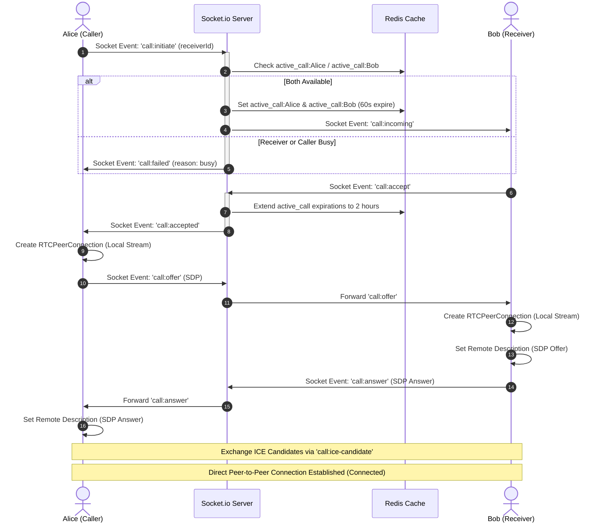

# Peer-to-Peer WebRTC Calling

**Vertex Connect** supports high-fidelity, real-time voice and video calling. This feature is implemented client-side using browser **WebRTC APIs** and coordinated backend-side via **Socket.io** signaling and **Redis** status locks.

---

## WebRTC Signaling & Connection Flow

WebRTC needs a signaling server to share setup info (SDP offers/answers and connection routes) before establishing a direct connection between users:

---

## Call Security & Availability Management

### 1. Privacy Check
Before starting a call, the server checks if you are allowed to call the other person:
* Calling rules are the same as messaging rules.
* If Bob's account is private, Alice must be a follower Bob also follows.
* If Bob only allows messages/calls from followers, Alice must follow Bob.
* If either user has blocked the other, the call is blocked immediately.

### 2. Preventing Double Calling (Redis Locks)
To stop users from making or receiving more than one call at a time:
* When Alice starts a call, the server checks Redis keys `active_call:Alice` and `active_call:Bob`.
* If either is busy, the call is blocked and returns a "busy" message.
* If both are free, the server marks both users as busy in Redis for 60 seconds (so the phone can ring).
* When Bob answers, the busy status is extended for up to 2 hours.
* When either user hangs up, these keys are deleted immediately.

---

## Client-Side Web Audio API Synthesis (`toneSynthesizer.js`)

Instead of downloading audio files for ringtones, the app creates sound waves directly in the browser using the Web Audio API. This keeps the app small and makes ringtones play instantly:

### 1. Outgoing Dial Tone (`playDialTone`)
* **Sound**: Alternates between 440 Hz and 480 Hz to sound like a standard phone line.
* **Timing**: Plays for 1.5 seconds (with a smooth start and end volume), then pauses for 2 seconds.

### 2. Incoming Ringtone (`playIncomingRingtone`)
* **Sound**: Plays an ascending C-Major/A-Minor chord sequence (notes C4, E4, G4, C5, E5).
* **Timing**: Plays each note 150ms apart and loops the ringtone every 3 seconds.

### 3. Call Hang-up Tone (`playEndTone`)
* **Sound**: Plays a quick double-beep that drops in pitch (350 Hz then 250 Hz).
* **Timing**: The first beep lasts 120ms, followed immediately by a 100ms beep.

---

## Connection Settings (ICE & TURN NAT Traversal)

To make calls work across different networks (like mobile data or strict firewalls), Vertex Connect gets connection paths dynamically:

### 1. Dynamic Settings
To protect bandwidth from abuse, we do not hardcode call server settings. Instead, the frontend requests temporary connection settings from the backend (`GET /api/call/ice-servers`). The backend connects to Metered.ca to generate settings that expire automatically.

### 2. Free Backup Server
If no Metered.ca settings are set up, the app automatically falls back to public free servers from the Open Relay Project. This makes mobile calls work out-of-the-box during local testing and live demos.

### 3. Pre-loading
To prevent delays when calling, the app loads these connection settings in the background (when the app starts, when making a call, or when receiving a call). This makes the call start instantly.
